## 哈希

### 1. 两数之和
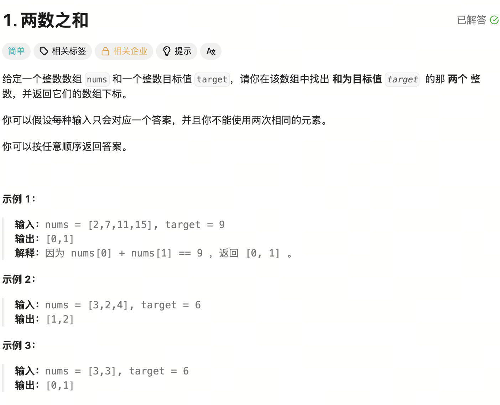
```
class Solution:
    def twoSum(self, nums: List[int], target: int) -> List[int]:
        hash = dict()
        for i,num in enumerate(nums):
            if target - num in hash:
                return [hash[target-num],i]
            hash[num] = i
        return []
```

### 2. 字母异位词分组
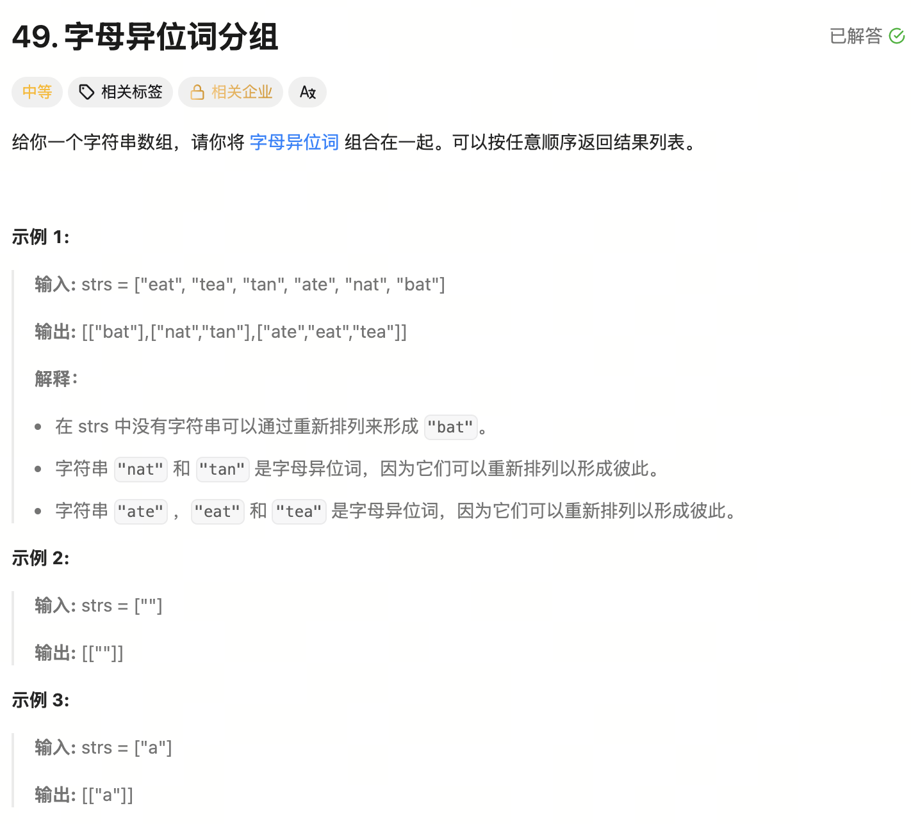
```
# C++可以对string排序
# python只能返回有序的列表，故需要把列表再拼成str ''.join(list)
# defaultdict(list) 带默认值的字典
# dict.values/ dict.keys 要类型转换为list
from typing import List
import collections
def groupAnagrams(strs: List[str]) -> List[List[str]]:
    hash = collections.defaultdict(list)
    for str in strs:
        key = ''.join(sorted(str))
        hash[key].append(str)
    
    return list(hash.values())
```
### 3. 最长连续序列
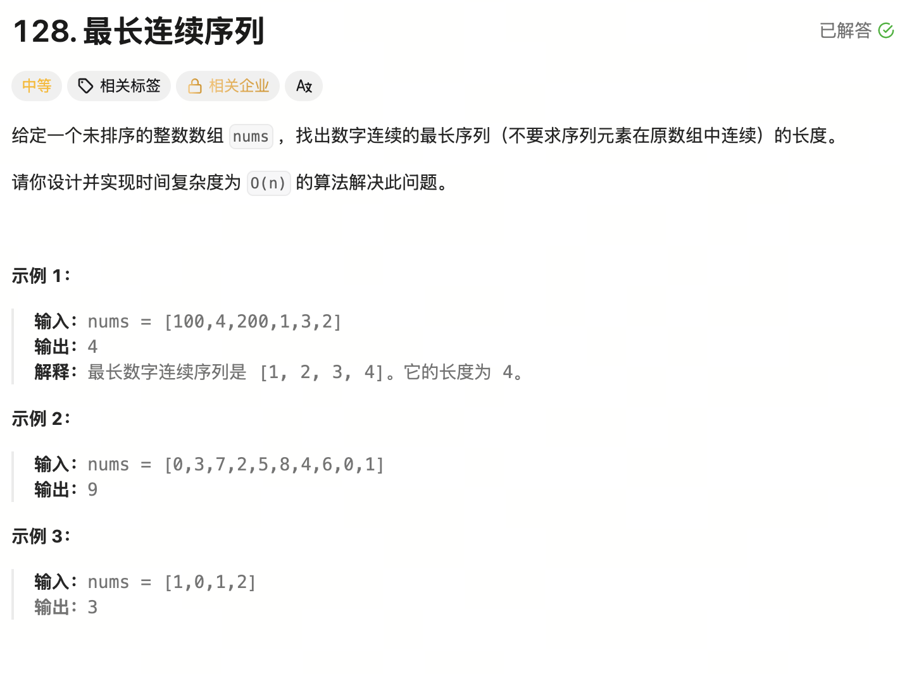
```
from typing import List

def longestConsecutive(nums: List[int]) -> int:
    """
    最长连续序列
    核心思想：使用哈希集合存储所有数字，只从每个连续序列的最小值开始向后查找
    """
    # 将数组转换为哈希集合，去重并支持 O(1) 查找
    num_set = set(nums)
    max_len = 0
    
    # 遍历集合中的每个数字
    for num in num_set:
        # 关键优化：如果 num-1 存在，说明 num 不是序列的最小值，跳过
        # 这样每个序列只会从最小值开始查找一次
        if num - 1 in num_set:
            continue
        
        # num 是当前连续序列的最小值，开始向后查找
        current_num = num + 1
        while current_num in num_set:
            current_num += 1
        
        # 更新最大长度
        max_len = max(max_len, current_num - num)
    
    return max_len

```

## 双指针
### 4. 移动零
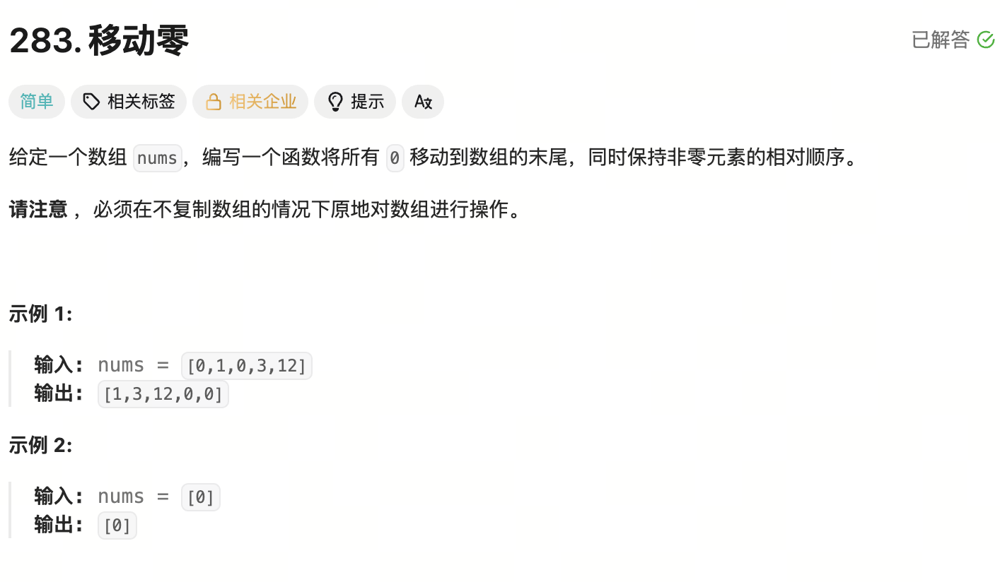
```
class Solution:
    def moveZeroes(self, nums: List[int]) -> None:
        left = right = 0
        while right<len(nums):
            if nums[right] !=0:
                nums[left], nums[right] = nums[right], nums[left]
                left+=1
            right+=1
```
### 5. 盛水最多的容器
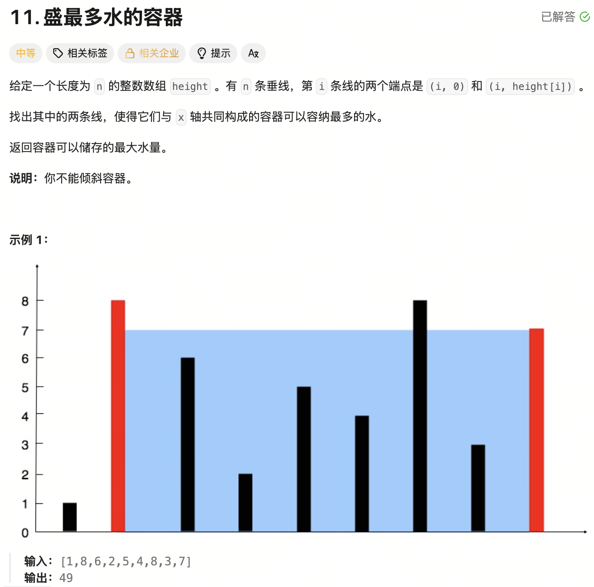
```
class Solution:
    def maxArea(self, height: List[int]) -> int:
        """
        盛最多水的容器
        核心思想：双指针，每次移动较短的那条边，因为面积由较短的边决定
        """
        left = 0
        right = len(height) - 1
        max_water = 0
        
        while left < right:
            # 计算当前面积：宽度 × 较小高度
            current_water = (right - left) * min(height[left], height[right])
            max_water = max(max_water, current_water)
            
            # 移动较短的边
            if height[left] < height[right]:
                left += 1
            else:
                right -= 1
        
        return max_water
```

### 6. 三数之和
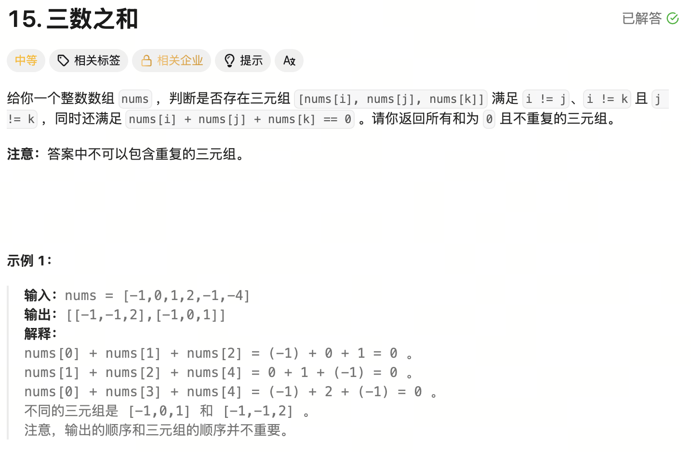
```
class Solution:
    def threeSum(self, nums: List[int]) -> List[List[int]]:
        """
        三数之和
        核心思想：排序 + 双指针
                固定一个数，在剩余区间内用双指针寻找两数之和等于 -nums[i]
        """
        # 1. 排序，便于去重和使用双指针
        nums.sort()
        n = len(nums)
        ans = []
        
        # 2. 固定第一个数
        for i in range(n):
            # 去重：如果当前数和前一个数相同，跳过
            if i > 0 and nums[i] == nums[i-1]:
                continue
            
            # 3. 双指针：j 从 i+1 开始，k 从末尾开始
            k = n - 1
            target = -nums[i]  # 需要找的两数之和
            
            for j in range(i + 1, n):
                # 去重：如果当前数和前一个数相同，跳过
                if j > i + 1 and nums[j] == nums[j-1]:
                    continue
                
                # 移动 k 指针，直到 nums[j] + nums[k] <= target
                while j < k and nums[j] + nums[k] > target:
                    k -= 1
                
                # 如果指针重合，说明后面的数都太大或太小，跳出循环
                if j == k:
                    break
                
                # 找到一组解
                if nums[j] + nums[k] == target:
                    ans.append([nums[i], nums[j], nums[k]])
        
        return ans
```
### 7. 接雨水
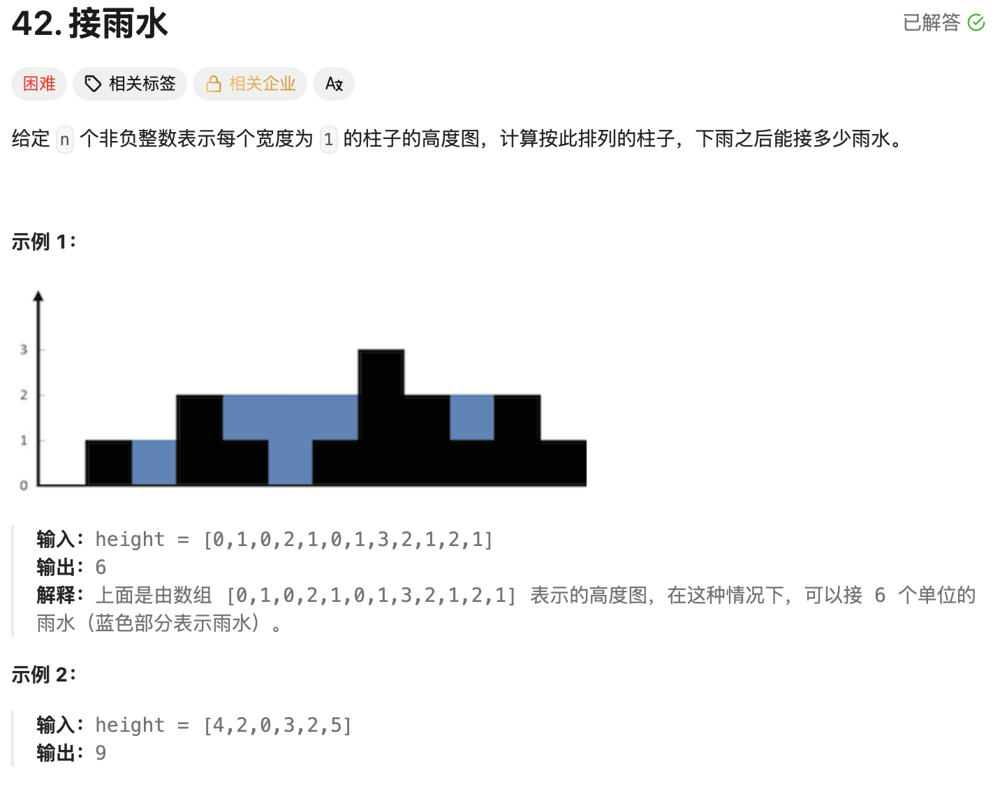
```
class Solution:
    def trap(self, height: List[int]) -> int:
        length = len(height)
        stack = []
        sum = 0
        for i in range(0,length):

            while stack and height[i] > height[stack[-1]]:
                # 弹出底部
                bottom = stack.pop()
                
                # 如果栈为空，说明没有左边界，无法形成凹槽
                if not stack:
                    break
                    
                # 左边界是栈顶
                left = stack[-1]
                
                # 计算宽度
                width = i - left - 1
                # 计算高度（取左右边界中较小的减去底部高度）
                h = min(height[left], height[i]) - height[bottom]
                
                sum += width * h
            
            # 将当前柱子索引入栈
            stack.append(i)
        return sum
```
## 滑动窗口
### 8. 无重复的最长字串
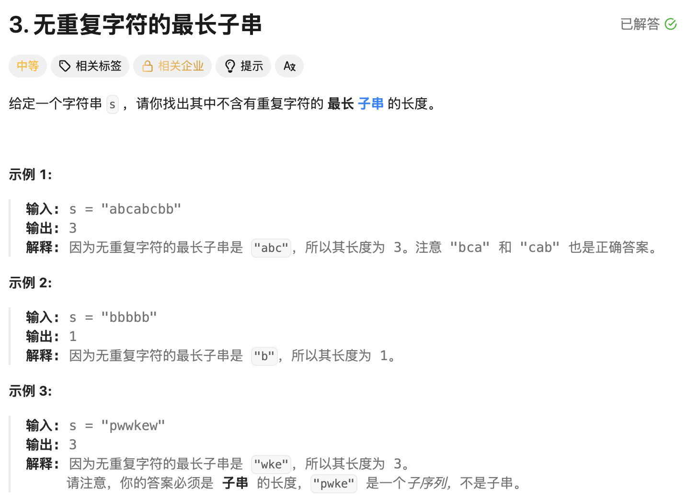
```
class Solution:
    def lengthOfLongestSubstring(self, s: str) -> int:
        """
        无重复字符的最长子串
        核心思想：滑动窗口，用哈希表记录窗口内字符的出现情况
        """
        # 哈希表记录字符是否在当前窗口中
        char_set = {}
        ans = 0
        n = len(s)
        
        # 处理边界情况
        if n <= 1:
            return n
        
        # 右指针
        j = 0
        
        # 左指针 i 遍历字符串
        for i in range(n):
            # 当左指针移动时，从窗口中移除前一个字符
            if i > 0:
                char_set[s[i-1]] = 0
            
            # 移动右指针，尽可能扩大窗口
            while j < n:
                # 如果当前字符已经在窗口中，停止扩大
                if char_set.get(s[j], 0) == 1:
                    break
                
                # 将当前字符加入窗口
                char_set[s[j]] = 1
                j += 1
                
                # 更新最大长度
                ans = max(ans, j - i)
        
        return ans
```
### 9. 找到字符串中的所有字母异位词
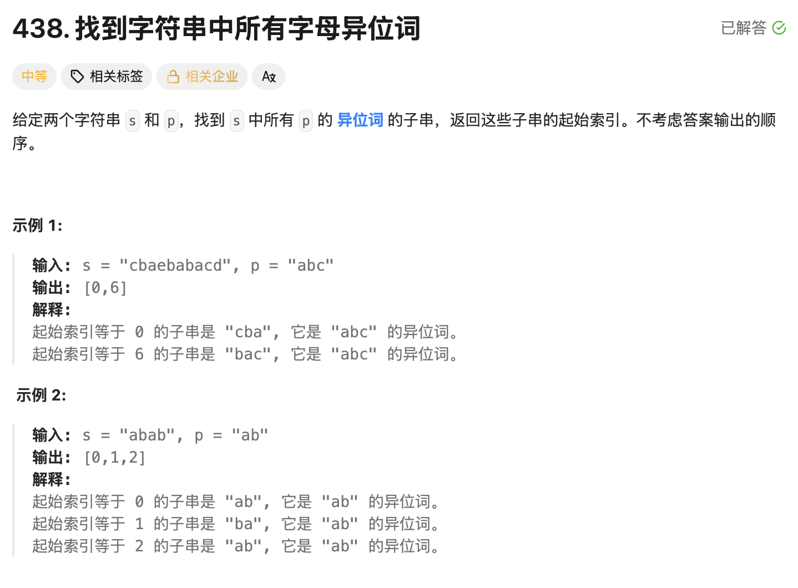
```

from typing import List

def findAnagrams(s: str, p: str) -> List[int]:
    if len(s) < len(p):
        return []
    
    hash_1 = {}  # 统计p的字符频率
    hash_2 = {}  # 统计窗口的字符频率
    ans = []
    
    # 统计p中字符频率
    for ch in p:
        hash_1[ch] = hash_1.get(ch, 0) + 1
    
    # 初始化第一个窗口
    len_p = len(p)
    for i in range(len_p):
        hash_2[s[i]] = hash_2.get(s[i], 0) + 1
    
    # 检查第一个窗口
    if hash_1 == hash_2:
        ans.append(0)
    
    # 滑动窗口
    for i in range(len_p, len(s)):
        # 添加新字符
        hash_2[s[i]] = hash_2.get(s[i], 0) + 1
        
        # 移除旧字符
        old_char = s[i - len_p]
        hash_2[old_char] -= 1
        # 如果字符计数为0，删除该键
        if hash_2[old_char] == 0:
            del hash_2[old_char]
        
        if hash_1 == hash_2:
            ans.append(i - len_p + 1)
    
    return ans
```
### 10. 和为K的子数组
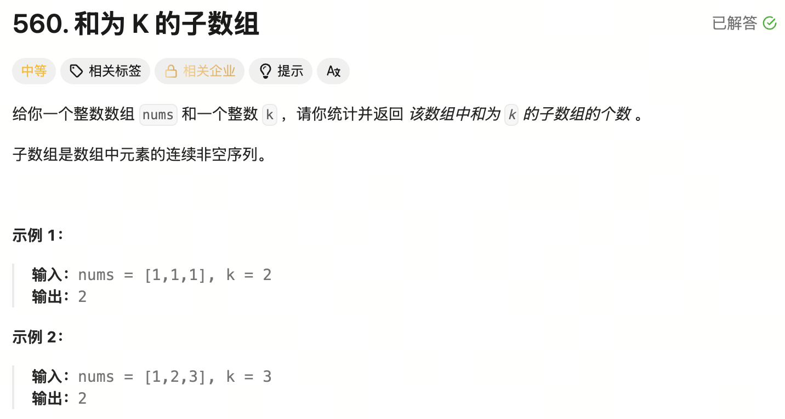
```
class Solution:
    def subarraySum(self, nums: List[int], k: int) -> int:
        prefix_sum_count = {0: 1}  # 初始前缀和为0，出现1次
        current_sum = 0
        ans = 0
        
        for num in nums:
            current_sum += num  # 计算当前前缀和
            
            # 查找是否存在前缀和等于 current_sum - k
            # 如果存在，说明从那个位置到当前位置的子数组和为k
            ans += prefix_sum_count.get(current_sum - k, 0)
            
            # 更新当前前缀和的出现次数
            prefix_sum_count[current_sum] = prefix_sum_count.get(current_sum, 0) + 1
        
        return ans
```

## 子串
### 11. 滑动窗口最大值
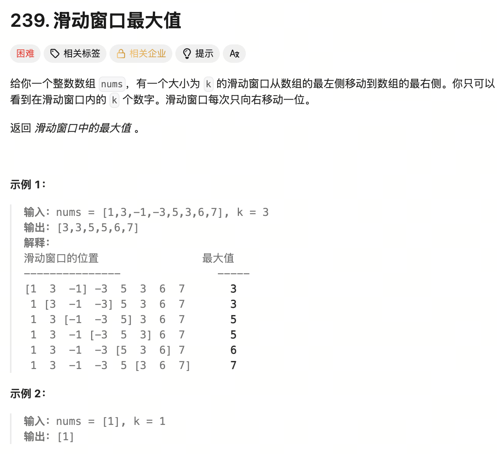
```
import heapq  # 需要导入堆模块
from typing import List

class Solution:
    def maxSlidingWindow(self, nums: List[int], k: int) -> List[int]:
        # 获取数组长度
        n = len(nums)
        
        # 初始化堆：存储(负数,索引)元组
        # 因为Python的heapq是小根堆，用负数把求最大值问题转为求最小值问题
        q = [(-nums[i], i) for i in range(k)]
        # 将列表转换为堆结构 O(k)
        heapq.heapify(q)
        
        # 第一个窗口的最大值：堆顶的负数取反
        ans = [-q[0][0]]
        
        # 遍历剩余元素，i表示当前窗口的右边界索引
        for i in range(k, n):
            # 1. 将新元素（负数,索引）加入堆中 O(log k)
            heapq.heappush(q, (-nums[i], i))
            
            # 2. 清理过期元素：堆顶索引 <= i-k 说明已滑出窗口
            while q[0][1] <= i - k:
                heapq.heappop(q)  # 弹出过期元素 O(log k)
            
            # 3. 当前堆顶即为窗口最大值（取反后加入结果）
            ans.append(-q[0][0])
        
        return ans
```
### 12. 最小覆盖字串
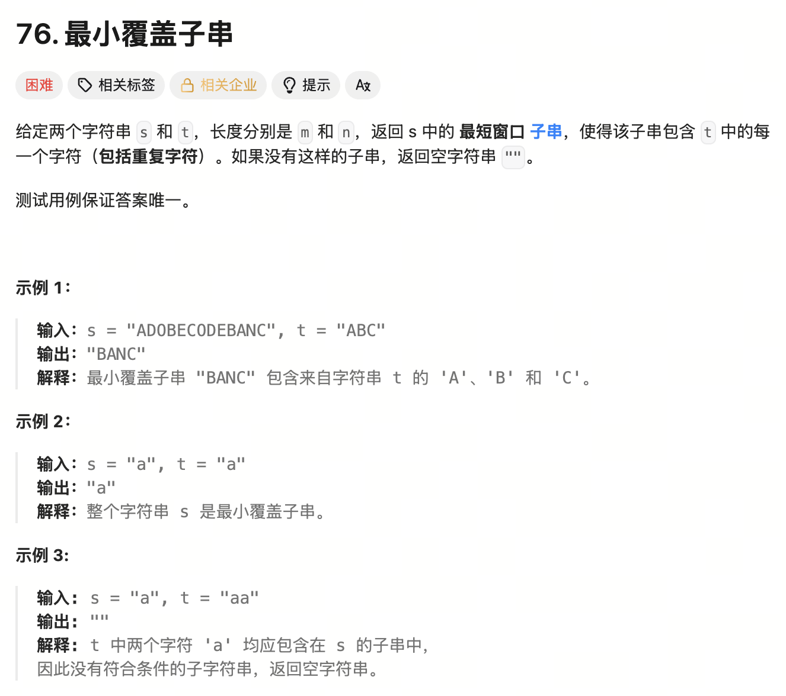

```
class Solution:
    def minWindow(self, s: str, t: str) -> str:
        # 两个哈希表：ori存储t中每个字符的需求量，cnt存储当前窗口中各字符的存量
        ori = collections.defaultdict(int)  # 需求表
        cnt = collections.defaultdict(int)  # 当前窗口存量表
        
        # 检查当前窗口是否满足需求
        def check() -> bool:
            for c, need_count in ori.items():
                # 如果当前窗口中某个字符的数量小于需求量，则不满足
                if cnt[c] < need_count:
                    return False
            return True
        
        # 初始化需求表：统计t中每个字符的出现次数
        for c in t:
            ori[c] += 1
        
        # 滑动窗口的左右指针
        l = 0
        r = -1  # 初始时窗口为空，r指向-1
        
        # 记录最小窗口的信息
        length = sys.maxsize  # 当前最小窗口长度
        ansL = -1  # 最小窗口的左边界
        ansR = -1  # 最小窗口的右边界（这里其实没用上，但保留原C++风格）
        
        # 扩展右边界，直到遍历完整个s
        while r < len(s) - 1:  # 当r还可以向右移动时
            # 1. 右指针右移，将新字符加入窗口
            r += 1
            # 如果这个字符是t中需要的，则更新存量表
            if s[r] in ori:
                cnt[s[r]] += 1
            
            # 2. 当窗口满足条件时，尝试收缩左边界
            while check() and l <= r:
                # 如果当前窗口比之前记录的最小窗口还小，则更新记录
                if r - l + 1 < length:
                    length = r - l + 1
                    ansL = l  # 记录左边界位置
                
                # 左指针右移前，如果左边要移除的字符是t中需要的，则减少存量
                if s[l] in ori:
                    cnt[s[l]] -= 1
                # 左指针右移，收缩窗口
                l += 1
        
        # 如果没找到符合条件的窗口，返回空字符串；否则返回最小窗口子串
        return "" if ansL == -1 else s[ansL:ansL + length]

```

## 普通数组

### 13. 最大字数组和
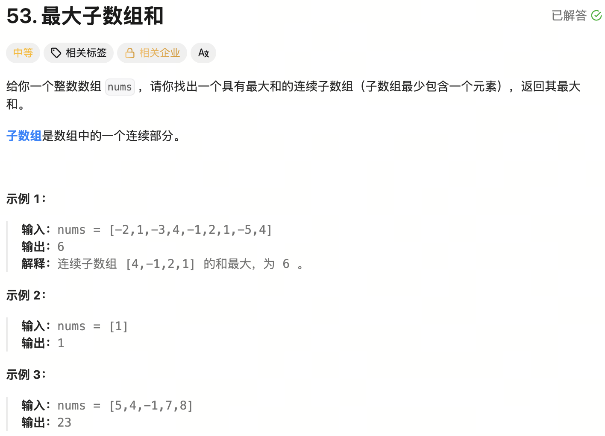

```
class Solution:
    def maxSubArray(self, nums: List[int]) -> int:
        # 初始化当前子数组和为0
        sum = 0
        # 初始化最大子数组和为第一个元素（不能初始化为0，因为可能全是负数）
        max_sum = nums[0]
        
        # 遍历数组中的每个数字
        for num in nums:
            # 如果之前的累加和 >= 0，说明对后续有正向贡献，继续累加
            if sum >= 0:
                sum += num
            # 如果之前的累加和 < 0，说明会拖累后续，舍弃并从当前元素重新开始
            else:
                sum = num
            
            # 更新最大子数组和
            max_sum = max(max_sum, sum)
        
        # 返回最大子数组和
        return max_sum

```

### 14. 合并区间
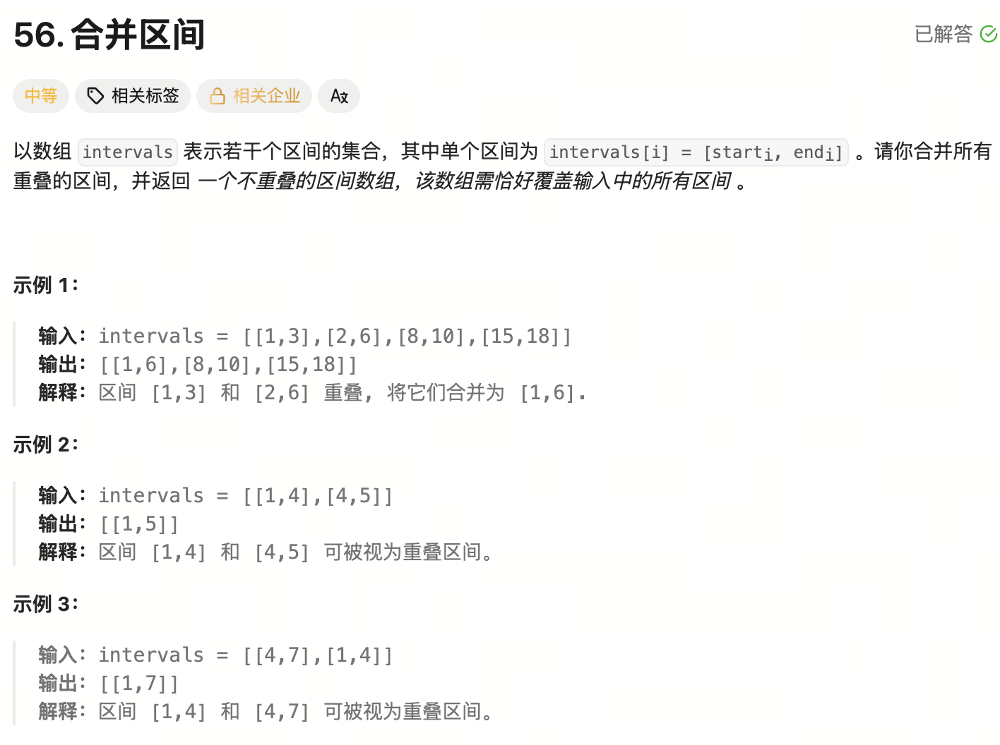

```
class Solution:
    def merge(self, intervals: List[List[int]]) -> List[List[int]]:
        # 1. 排序：将所有区间按照起始位置从小到大排序
        # 这样后面只需要顺序处理，保证前面的区间起始值 <= 后面的区间起始值
        intervals.sort(key=lambda x: x[0])

        # 2. 初始化结果列表，用于存放合并后的区间
        merged = []
        
        # 3. 遍历每个区间
        for interval in intervals:
            # 4. 判断条件：如果是第一个区间，或者当前区间与上一个区间不重叠
            # 不重叠的条件是：当前区间的起始值 > 上一个区间的结束值
            if not merged or merged[-1][1] < interval[0]:
                # 5. 不重叠：直接将当前区间加入结果列表
                merged.append(interval)
            else:
                # 6. 重叠：需要合并区间
                # 合并的方式是：保持起始值不变（因为已经排序），结束值取两者的最大值
                # 注意：这里直接修改上一个区间的结束值
                merged[-1][1] = max(merged[-1][1], interval[1])

        # 7. 返回合并后的区间列表
        return merged
```

    sort(): 
    默认升序排列
    numbers = [3, 1, 4, 1, 5]
    numbers.sort()
    print(numbers)  # [1, 1, 3, 4, 5]
    降序排序
    numbers.sort(reverse=True)
    print(numbers)  # [5, 4, 3, 1, 1]

    intervals.sort(key=lambda x: x[0])
    按照每个区间的第一个元素（起始值）进行排序
    分解说明：
    key 参数：指定排序的依据
    lambda x: x[0]：是一个匿名函数，接收一个参数 x（在这里是每个区间），返回 x[0]（区间的起始值）
    排序过程：Python 会根据每个区间返回的起始值大小来排序

### 15. 轮转数组

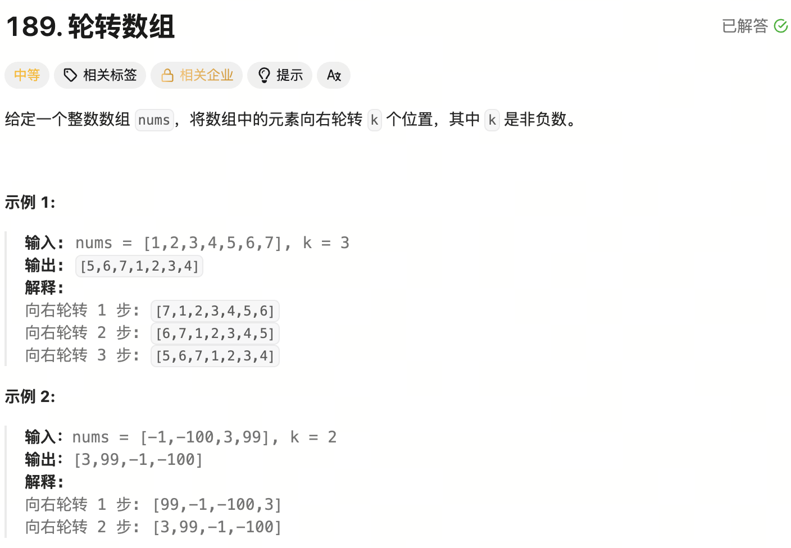
```
from typing import List

class Solution:
    def rotate(self, nums: List[int], k: int) -> None:
        """
        旋转数组：将数组中的元素向右移动 k 个位置
        注意：不要返回任何东西，直接修改原数组
        """
        
        # 定义辅助函数：反转数组中指定范围的元素
        def reverse(nums: List[int], start: int, end: int) -> None:
            """
            反转数组 nums 中从 start 到 end 的部分（包含两端）
            例如：reverse([1,2,3,4], 0, 2) → [3,2,1,4]
            """
            # 双指针法，从两端向中间交换元素
            while start < end:
                # 交换 start 和 end 位置的元素
                nums[start], nums[end] = nums[end], nums[start]
                # 左指针右移，右指针左移
                start += 1
                end -= 1
        
        # 1. 处理 k：如果 k 大于数组长度，取余数
        # 例如：数组长度=5，k=7 相当于旋转 7%5=2 次
        k = k % len(nums)
        
        # 2. 核心三步反转法：
        #   这是旋转数组的最优解法，时间复杂度 O(n)，空间复杂度 O(1)
        
        # 第一步：反转整个数组
        # 例如：[1,2,3,4,5,6,7] → [7,6,5,4,3,2,1]
        reverse(nums, 0, len(nums) - 1)
        
        # 第二步：反转前 k 个元素
        # 例如：k=3 → 反转前3个 [7,6,5,4,3,2,1] → [5,6,7,4,3,2,1]
        reverse(nums, 0, k - 1)
        
        # 第三步：反转剩下的元素
        # 例如：反转后4个 [5,6,7,4,3,2,1] → [5,6,7,1,2,3,4]
        reverse(nums, k, len(nums) - 1)
        
        # 最终结果：[1,2,3,4,5,6,7] 旋转 k=3 次 → [5,6,7,1,2,3,4]
```
 ### 16. 除自身以外数组的乘积
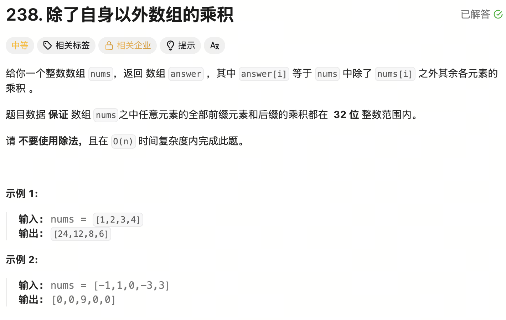
 ```
 class Solution:
    def productExceptSelf(self, nums: List[int]) -> List[int]:
        """
        计算除自身以外数组的乘积
        思路：每个位置的答案 = 左边所有数的乘积 * 右边所有数的乘积
        """
        length = len(nums)
        # 初始化结果数组，长度与输入相同
        answer = [0] * length
        
        # === 第一轮遍历：计算每个位置左边所有数的乘积 ===
        # answer[i] 表示索引 i 左侧所有元素的乘积
        # 因为索引为 '0' 的元素左侧没有元素，所以 answer[0] = 1
        answer[0] = 1
        for i in range(1, length):
            # 左边乘积 = 上一个数 * 上一个数的左边乘积
            # 例如：answer[2] = nums[1] * answer[1]
            answer[i] = nums[i - 1] * answer[i - 1]
        
        # === 第二轮遍历：乘以每个位置右边所有数的乘积 ===
        # R 为右侧所有元素的乘积（动态更新）
        # 刚开始最后一个元素的右边没有元素，所以 R = 1
        R = 1
        # 从右向左遍历
        for i in reversed(range(length)):
            # 对于索引 i：
            # - answer[i] 是左边乘积（第一轮计算好的）
            # - R 是右边乘积（从右向左累加）
            # 最终结果 = 左边乘积 * 右边乘积
            answer[i] = answer[i] * R
            
            # 更新 R：将当前元素乘进去，为下一个左边位置做准备
            # 因为下一个索引 i-1 的右边乘积要包含 nums[i]
            R *= nums[i]
        
        return answer
```
## 回溯

### 全排列
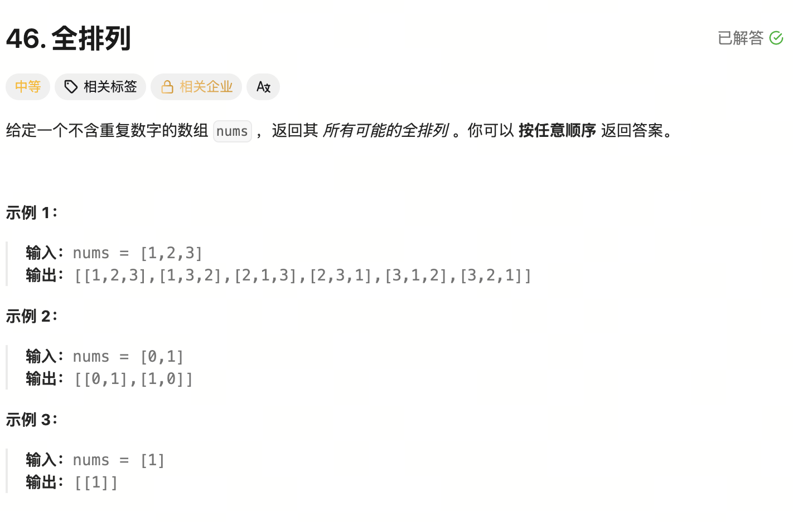
```
class Solution:
    def permute(self, nums: List[int]) -> List[List[int]]:
        """
        全排列（回溯法）
        核心思想：遍历所有数字，每层选一个新数字，用标记数组记录哪些数字已被使用，递归构建排列
        """
        # 初始化结果列表
        self.ans = []
        # 当前正在构建的排列
        self.path = []
        # 标记数组，记录每个位置的数字是否已被使用
        self.used = [False] * len(nums)

        # 定义回溯函数
        def backtrack():
            # 如果当前路径长度等于数组长度，说明找到了一个完整排列
            if len(self.path) == len(nums):
                # 将当前路径的副本加入结果（因为后续会修改）
                self.ans.append(self.path[:])
                return

            # 遍历所有数字
            for i in range(len(nums)):
                # 如果当前数字已被使用，跳过
                if self.used[i]:
                    continue

                # 做选择：将 nums[i] 加入路径，并标记为已使用
                self.used[i] = True
                self.path.append(nums[i])

                # 递归进入下一层
                backtrack()

                # 撤销选择：回溯，恢复状态
                self.path.pop()
                self.used[i] = False

        # 启动回溯
        backtrack()
        return self.ans
```

### 子集
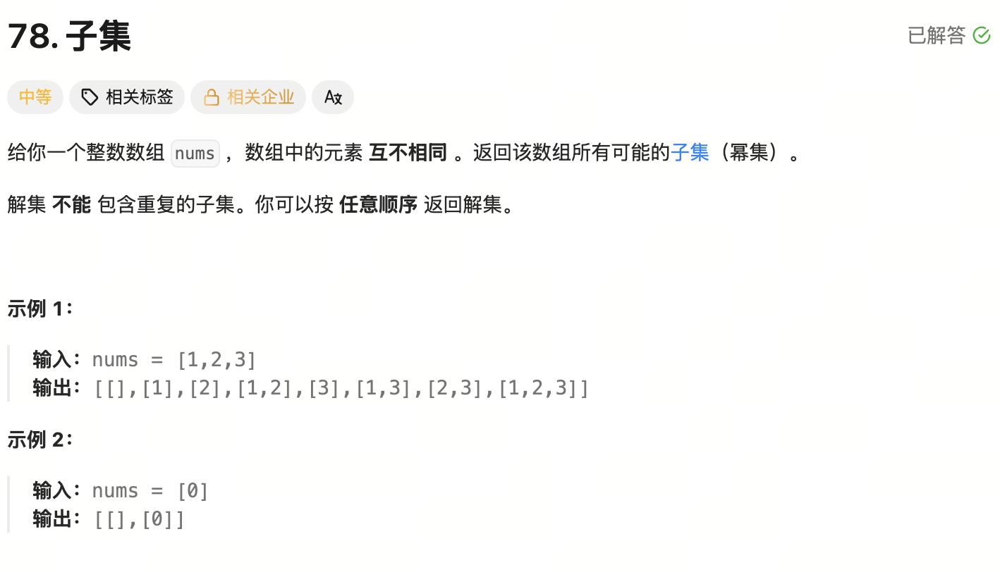
```
class Solution:
    def subsets(self, nums: List[int]) -> List[List[int]]:
        """
        求数组的所有子集（回溯法）
        核心思想：每个元素都有选或不选两种可能，通过回溯枚举所有组合
        """
        # 初始化结果列表和当前路径
        self.ans = []
        self.path = []
        
        def dfs(start: int):
            """
            深度优先搜索
            start: 当前可以选择的起始索引（保证不重复，且顺序递增）
            """
            # 1. 将当前路径加入结果（注意要复制，避免后续修改影响）
            self.ans.append(self.path[:])
            
            # 2. 递归终止条件：如果已经遍历到数组末尾，直接返回
            #    其实这里也可以不写，因为for循环会自动结束
            if start == len(nums):
                return
            
            # 3. 从start开始遍历，依次尝试将每个元素加入路径
            for i in range(start, len(nums)):
                # 做选择：将nums[i]加入路径
                self.path.append(nums[i])
                
                # 递归：下一层从i+1开始，避免重复使用同一个元素
                dfs(i + 1)
                
                # 撤销选择：回溯，恢复状态
                self.path.pop()
        
        # 从索引0开始搜索
        dfs(0)
        return self.ans

```

### 电话号码的字母组合
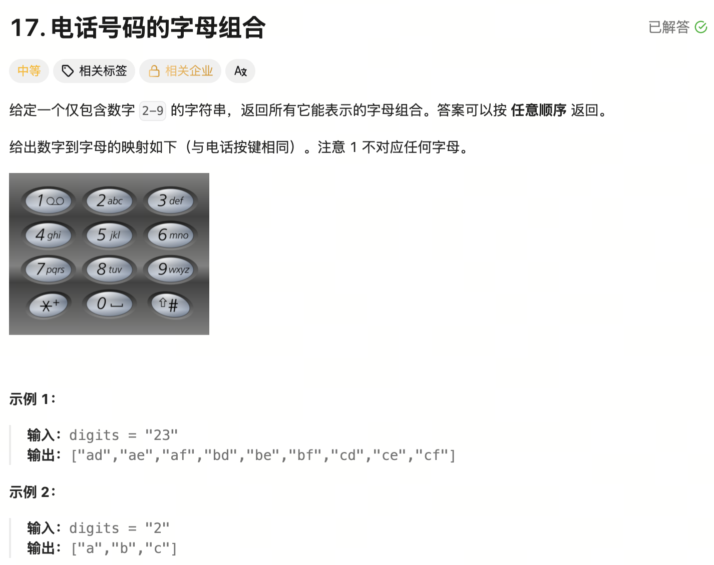
```
class Solution:
    def __init__(self):
        # 初始化结果列表和当前路径字符串
        self.ans = []
        self.path = []
        # 数字到字母的映射表
        self.phone = {
            '2': "abc",
            '3': "def",
            '4': "ghi",
            '5': "jkl",
            '6': "mno",
            '7': "pqrs",
            '8': "tuv",
            '9': "wxyz"
        }
    
    def letterCombinations(self, digits: str) -> List[str]:
        """
        电话号码的字母组合（回溯法）
        核心思想：每个数字对应一组字母，通过回溯枚举所有可能的组合
        """
        # 边界情况：空输入返回空列表
        if not digits:
            return []
        
        # 清空成员变量（防止多次调用时残留）
        self.ans = []
        self.path = []
        
        # 开始回溯
        self.backtrack(digits, 0)
        return self.ans
    
    def backtrack(self, digits: str, index: int):
        """
        回溯函数
        digits: 输入的数字字符串
        index: 当前处理的数字位置
        """
        # 如果已经处理完所有数字，将当前路径加入结果
        if index == len(digits):
            self.ans.append(''.join(self.path))
            return
        
        # 获取当前数字对应的字母串
        letters = self.phone[digits[index]]
        
        # 遍历当前数字的每个字母
        for ch in letters:
            # 做选择：将当前字母加入路径
            self.path.append(ch)
            # 递归处理下一个数字
            self.backtrack(digits, index + 1)
            # 撤销选择：回溯
            self.path.pop()
```

### 组合总和
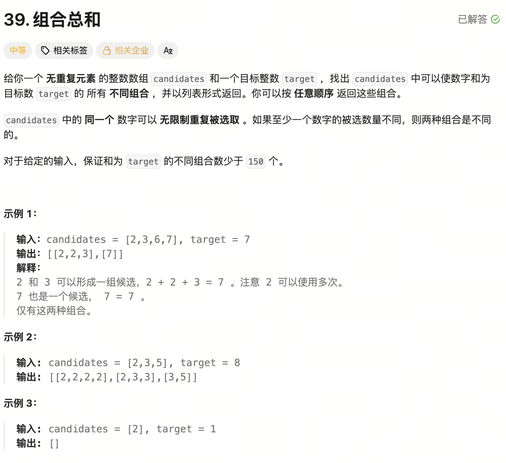
```
from typing import List

class Solution:
    def combinationSum(self, candidates: List[int], target: int) -> List[List[int]]:
        """
        组合总和（可重复使用同一元素）
        核心思想：回溯法，每次从当前索引开始尝试，避免重复组合
        """
        # 初始化结果列表、当前路径和当前和
        self.ans = []          # 存放所有有效组合
        self.path = []         # 当前正在构建的组合
        self.current_sum = 0   # 当前路径的和
        
        # 开始回溯，从索引0开始
        self.backtrack(candidates, target, 0)
        return self.ans
    
    def backtrack(self, candidates: List[int], target: int, start: int) -> None:
        """
        回溯函数
        candidates: 候选数组
        target: 目标和
        start: 当前可选的起始索引（保证组合递增，避免重复）
        """
        # 剪枝：如果当前和已经超过目标，直接返回
        if self.current_sum > target:
            return
        
        # 找到一个有效组合，加入结果
        if self.current_sum == target:
            # 注意：需要加入当前路径的副本，因为后续会修改
            self.ans.append(self.path[:])
            # 注意：这里没有立即返回，因为后续尝试都会使和变大，但下一层递归会因 >target 而返回
            # 为了效率，也可以在这里加上 return，但原代码没有，我们保留原样
        
        # 从 start 开始遍历，保证每个元素只考虑一次（但可以重复使用，因为下一层仍从当前索引开始）
        for i in range(start, len(candidates)):
            # 做选择：将 candidates[i] 加入路径，并累加和
            self.path.append(candidates[i])
            self.current_sum += candidates[i]
            
            # 递归：因为可以重复使用同一元素，下一层仍从 i 开始
            self.backtrack(candidates, target, i)
            
            # 撤销选择：回溯，恢复状态
            self.path.pop()
            self.current_sum -= candidates[i]

```

### 括号生成
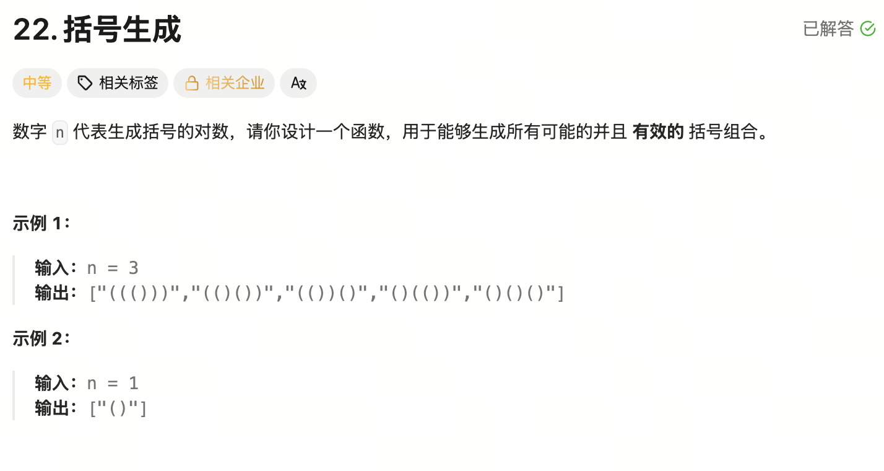
```
class Solution:
    def generateParenthesis(self, n: int) -> List[str]:
        """
        生成所有有效的括号组合（暴力递归法）
        核心思想：递归生成所有可能的 2^(2n) 种括号序列，然后逐一验证有效性
        """
        # 初始化结果列表和当前路径字符串
        self.ans = []
        self.path = []
        
        def backtrack():
            """回溯生成所有可能的括号序列"""
            # 如果当前路径长度达到 2n，检查是否有效
            if len(self.path) == 2 * n:
                if is_valid(self.path):
                    self.ans.append(''.join(self.path))
                return
            
            # 尝试添加左括号
            self.path.append('(')
            backtrack()
            self.path.pop()
            
            # 尝试添加右括号
            self.path.append(')')
            backtrack()
            self.path.pop()
        
        def is_valid(s: List[str]) -> bool:
            """验证括号序列是否有效"""
            balance = 0
            for ch in s:
                if ch == '(':
                    balance += 1
                else:  # ch == ')'
                    balance -= 1
                if balance < 0:  # 右括号多于左括号，提前失效
                    return False
            return balance == 0  # 最后左右括号数相等
        
        backtrack()
        return self.ans
```

### 单词搜索
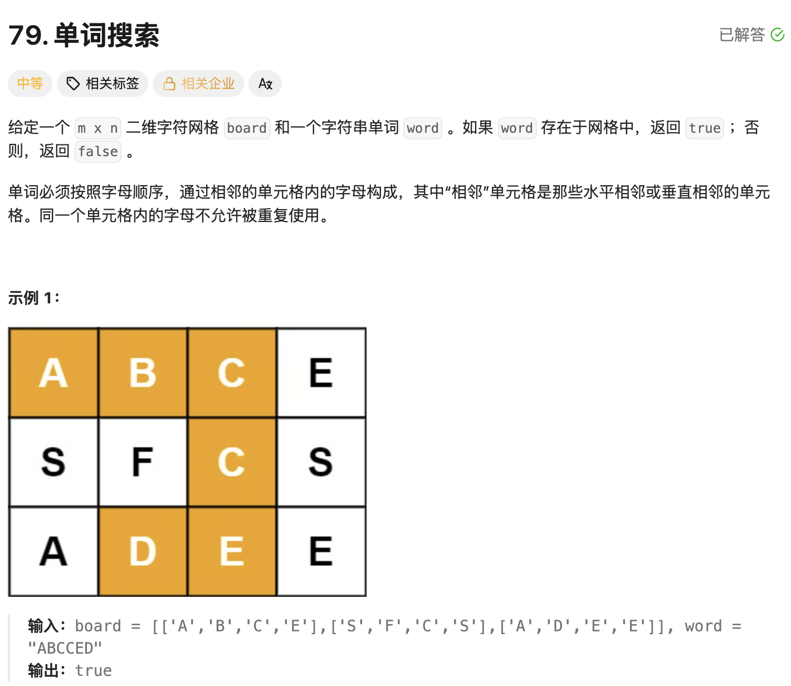
```
class Solution:
    def exist(self, board: List[List[str]], word: str) -> bool:
        """
        判断单词是否存在于二维网格中
        核心思想：回溯 + 剪枝，从每个格子出发深度优先搜索
        """
        # 获取网格的行数和列数
        rows, cols = len(board), len(board[0])
        # 创建访问标记矩阵，初始全为 False
        visited = [[False] * cols for _ in range(rows)]
        
        # 定义四个方向：右、左、下、上
        directions = [(0, 1), (0, -1), (1, 0), (-1, 0)]
        
        def backtrack(i: int, j: int, k: int) -> bool:
            """
            从 board[i][j] 开始匹配 word 的第 k 个字符
            返回是否找到一条完整路径
            """
            # 如果当前字符不匹配，直接返回 False
            if board[i][j] != word[k]:
                return False
            
            # 如果已经匹配到最后一个字符，说明找到完整单词
            if k == len(word) - 1:
                return True
            
            # 标记当前格子已访问
            visited[i][j] = True
            
            # 尝试四个方向
            for di, dj in directions:
                new_i, new_j = i + di, j + dj
                # 检查新坐标是否在网格范围内
                if 0 <= new_i < rows and 0 <= new_j < cols:
                    # 如果新格子未被访问，则递归探索
                    if not visited[new_i][new_j]:
                        if backtrack(new_i, new_j, k + 1):
                            return True
            
            # 回溯：撤销访问标记
            visited[i][j] = False
            return False
        
        # 遍历每个格子作为起点
        for i in range(rows):
            for j in range(cols):
                if backtrack(i, j, 0):
                    return True
        return False
```

### 分割回文串
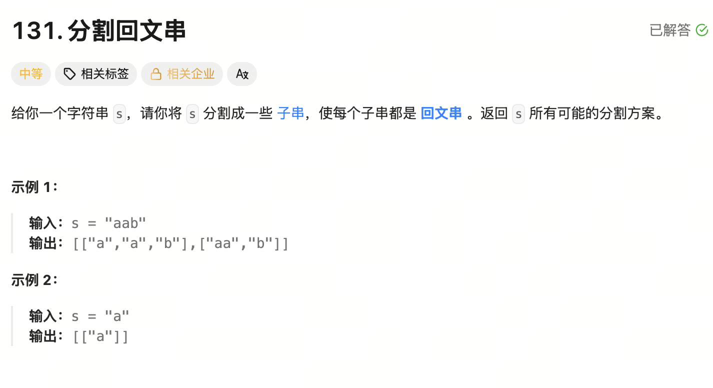
```
class Solution:
    def partition(self, s: str) -> List[List[str]]:
        """
        分割回文串
        核心思想：回溯法，从起始位置开始，尝试所有可能的子串，
                如果是回文，则加入当前分割，并递归处理剩余部分
        """
        # 初始化结果列表和当前分割路径
        self.ans = []      # 存放所有有效分割方案
        self.path = []     # 存放当前正在构建的分割
        
        def is_palindrome(sub: str) -> bool:
            """判断子串是否为回文串"""
            left, right = 0, len(sub) - 1
            while left < right:
                if sub[left] != sub[right]:
                    return False
                left += 1
                right -= 1
            return True
        
        def backtrack(start: int):
            """
            回溯函数
            start: 当前开始分割的起始索引
            """
            # 如果已经处理完整个字符串，将当前路径加入结果
            if start == len(s):
                self.ans.append(self.path[:])  # 注意要复制
                return
            
            # 从 start 开始，尝试所有可能的结束位置
            for end in range(start, len(s)):
                # 获取当前子串 [start, end]
                substr = s[start:end+1]
                
                # 如果当前子串不是回文，跳过
                if not is_palindrome(substr):
                    continue
                
                # 做选择：将当前回文子串加入路径
                self.path.append(substr)
                
                # 递归处理剩余部分（从 end+1 开始）
                backtrack(end + 1)
                
                # 撤销选择：回溯
                self.path.pop()
        
        # 从索引0开始回溯
        backtrack(0)
        return self.ans
```

### N皇后
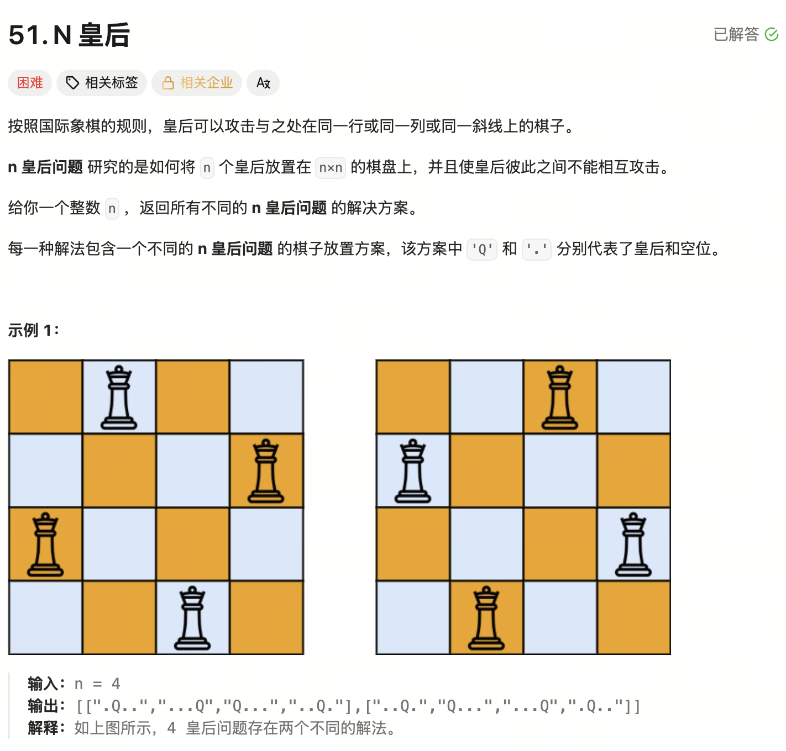
```
class Solution:
    def solveNQueens(self, n: int) -> List[List[str]]:
        """
        N 皇后问题
        核心思想：回溯法，逐行放置皇后，每行尝试所有列，
                检查当前位置是否与已放置的皇后冲突（同列、对角线）
        """
        # 初始化结果列表和当前路径
        self.ans = []          # 存放所有有效棋盘
        self.path = []         # 当前正在构建的棋盘，每个元素是一个字符串（一行）
        
        def is_safe(col: int) -> bool:
            """
            检查在当前行（即 path 的长度）的 col 列放置皇后是否安全
            需要检查：1. 同一列是否有皇后
                     2. 左上对角线是否有皇后
                     3. 右上对角线是否有皇后
            """
            current_row = len(self.path)  # 当前要放置的行
            for row in range(current_row):
                # 检查同一列
                if self.path[row][col] == 'Q':
                    return False
                # 检查左上对角线：列差 = 行差
                if col - (current_row - row) >= 0 and self.path[row][col - (current_row - row)] == 'Q':
                    return False
                # 检查右上对角线：列差 = 行差
                if col + (current_row - row) < n and self.path[row][col + (current_row - row)] == 'Q':
                    return False
            return True
        
        def backtrack():
            """回溯函数：逐行放置皇后"""
            # 如果已经放满 n 行，说明找到一个有效解
            if len(self.path) == n:
                self.ans.append(self.path[:])  # 注意复制
                return
            
            # 生成当前行的初始字符串，全是 '.'
            row_str = ['.'] * n
            # 尝试当前行的每一列
            for col in range(n):
                if is_safe(col):
                    # 做选择：放置皇后
                    row_str[col] = 'Q'
                    self.path.append(''.join(row_str))
                    
                    # 递归进入下一行
                    backtrack()
                    
                    # 撤销选择：回溯
                    self.path.pop()
                    row_str[col] = '.'  # 恢复当前行的字符
        
        backtrack()
        return self.ans
```

## 二分查找
### 搜索插入位置
```
class Solution:
    def searchInsert(self, nums: List[int], target: int) -> int:
        """
        搜索插入位置
        给定一个排序数组和一个目标值，在数组中找到目标值，并返回其索引。
        如果目标值不存在于数组中，返回它将会被按顺序插入的位置。
        要求：时间复杂度 O(log n)
        """
        # 初始化左右指针
        left, right = 0, len(nums) - 1
        
        # 二分查找循环，当 left > right 时退出
        while left <= right:
            # 计算中间位置，避免整数溢出的写法（Python不需要，但保持习惯）
            mid = left + (right - left) // 2
            
            if nums[mid] < target:
                # 目标值在右半部分，移动左指针
                left = mid + 1
            elif nums[mid] > target:
                # 目标值在左半部分，移动右指针
                right = mid - 1
            else:
                # 找到目标值，直接返回索引
                return mid
        
        # 循环结束时，left 指向第一个大于 target 的位置，即插入位置 假设重合了，right继续减1，left不动
        return left
```

### 搜索二维矩阵

```
class Solution:
    def searchMatrix(self, matrix: List[List[int]], target: int) -> bool:
        """
        搜索二维矩阵
        矩阵特性：每行从左到右递增，每行的第一个元素大于上一行的最后一个元素（整体有序）
        核心思想：两次二分查找
                 1. 在第一列中二分查找，找到最后一个小于等于 target 的行
                 2. 在该行中二分查找 target
        """
        m, n = len(matrix), len(matrix[0])
        
        # === 第一步：在第一列中二分查找，确定可能所在的行 ===
        l_row, r_row = 0, m - 1
        while l_row <= r_row:
            mid_row = (l_row + r_row) // 2
            if matrix[mid_row][0] == target:
                return True
            elif matrix[mid_row][0] < target:
                l_row = mid_row + 1
            else:
                r_row = mid_row - 1
        
        # 循环结束时，r_row 指向最后一个小于 target 的行
        # 如果 r_row < 0，说明 target 小于所有行的第一个元素，不存在
        target_row = r_row
        if target_row < 0:
            return False
        
        # === 第二步：在确定的行中进行二分查找 ===
        l_col, r_col = 0, n - 1
        while l_col <= r_col:
            mid_col = (l_col + r_col) // 2
            if matrix[target_row][mid_col] == target:
                return True
            elif matrix[target_row][mid_col] < target:
                l_col = mid_col + 1
            else:
                r_col = mid_col - 1
        
        return False
```

### 在排序数组中查找第一个和最后一个位置
```
class Solution:
    def __init__(self):
        # 初始化最小索引和最大索引
        self.min_index = float('inf')
        self.max_index = -1
    
    def searchRange(self, nums: List[int], target: int) -> List[int]:
        """
        在排序数组中查找元素的第一个和最后一个位置
        核心思想：二分查找 + 递归扩展边界
        """
        # 处理空数组
        if not nums:
            return [-1, -1]
        
        # 开始递归查找
        self.binary_search(nums, 0, len(nums) - 1, target)
        
        # 如果找到了目标，返回最小和最大索引；否则返回[-1, -1]
        if self.max_index >= 0:
            return [self.min_index, self.max_index]
        return [-1, -1]
    
    def binary_search(self, nums: List[int], left: int, right: int, target: int) -> None:
        """
        二分查找并递归扩展边界
        """
        # 递归终止条件
        if left > right:
            return
        
        # 二分查找
        mid = (left + right) // 2
        if nums[mid] == target:
            # 更新边界
            self.min_index = min(self.min_index, mid)
            self.max_index = max(self.max_index, mid)
            
            # 关键：在左右两侧继续查找，因为可能还有相同的目标值
            # 在左半部分继续查找（可能还有更左边的目标）
            self.binary_search(nums, left, mid - 1, target)
            # 在右半部分继续查找（可能还有更右边的目标）
            self.binary_search(nums, mid + 1, right, target)
        elif nums[mid] < target:
            # 目标在右半部分
            self.binary_search(nums, mid + 1, right, target)
        else:
            # 目标在左半部分
            self.binary_search(nums, left, mid - 1, target)
```

### 搜索旋转排序数组

```
class Solution:
    def search(self, nums: List[int], target: int) -> int:
        """
        搜索旋转排序数组
        数组原本是升序的，但在某个点进行了旋转，例如 [4,5,6,7,0,1,2]
        要求：时间复杂度 O(log n)
        核心思想：二分查找，通过比较 nums[mid] 与 nums[left] 的关系，
                判断左半部分还是右半部分是有序的，然后决定搜索方向
                最终总会收敛到一个有序的区间
        """
        left, right = 0, len(nums) - 1
        
        while left <= right:
            mid = (left + right) // 2
            
            # 找到目标，直接返回
            if nums[mid] == target:
                return mid
            
            # 判断左半部分是否有序（即 nums[left] <= nums[mid]）
            # 确定target位置
            if nums[left] <= nums[mid]:
                # 左半部分有序
                # 如果 target 在左半部分的范围内，则收缩右边界
                if nums[left] <= target < nums[mid]:
                    right = mid - 1
                else: # target很大或者很小都在右侧
                    # 否则 target 在右半部分，收缩左边界
                    left = mid + 1
            else:
                # 右半部分有序（因为左半部分无序，右半部分必然有序）
                # 如果 target 在右半部分的范围内，则收缩左边界
                if nums[mid] < target <= nums[right]:
                    left = mid + 1
                else:
                    # 否则 target 在左半部分，收缩右边界
                    right = mid - 1
        
        # 没找到
        return -1
```
### 搜索旋转排序数组最小值
```
class Solution:
    def findMin(self, nums: List[int]) -> int:
        """
        寻找旋转排序数组中的最小值
        数组原本是升序的，但在某个点进行了旋转，例如 [4,5,6,7,0,1,2]
        要求：时间复杂度 O(log n)
        核心思想：二分查找，通过比较 nums[mid] 与 nums[right] 的关系，
                判断最小值在左半部分还是右半部分
        """
        left, right = 0, len(nums) - 1
        ans = float('inf')  # 初始化最小值为正无穷
        
        while left <= right:
            mid = (left + right) // 2
            # 更新最小值
            ans = min(ans, nums[mid])
            
            # 关键判断：如果中间值 <= 右端点值，说明右半部分是有序的
            # 最小值在左半部分（包括 mid 本身）
            if nums[mid] <= nums[right]:
                right = mid - 1
            else:
                # 否则，最小值在右半部分
                left = mid + 1
        
        return ans
```

## 贪心

### 买卖股票的最佳时机
```
class Solution:
    def maxProfit(self, prices: List[int]) -> int:
        """
        买卖股票的最佳时机（只能买卖一次）
        核心思想：遍历过程中，记录历史最低价格，同时计算当天卖出能获得的最大利润
        """
        max_profit = 0          # 最大利润
        min_price = float('inf') # 历史最低价格，初始化为正无穷
        
        for price in prices:
            # 更新最大利润：当前价格减去历史最低价
            max_profit = max(max_profit, price - min_price)
            # 更新历史最低价
            min_price = min(min_price, price)
        
        return max_profit
```

### 跳跃游戏
```
class Solution:
    def canJump(self, nums: List[int]) -> bool:
        """
        跳跃游戏
        核心思想：贪心算法，维护当前能到达的最远位置
        """
        max_reach = 0  # 当前能到达的最远位置
        
        for i in range(len(nums)):
            # 如果当前最远位置已经能到达或超过最后一个位置，返回 True
            if max_reach >= len(nums) - 1:
                return True
            
            # 更新最远位置：从当前位置能跳到的最远位置 i + nums[i]
            max_reach = max(max_reach, i + nums[i])
            
            # 如果最远位置就是当前位置，说明无法继续前进 (nums[i]==0)
            if i == max_reach:
                return False
        
        return False
```
### 跳跃游戏2
```
class Solution:
    def jump(self, nums: List[int]) -> int:
        """
        跳跃游戏 II
        核心思想：贪心算法，每一步都选择当前范围内能跳到的最远位置
        """
        max_reach = 0      # 当前能到达的最远位置
        min_steps = 0      # 当前使用的步数
        step_end = 0       # 当前步数能到达的边界
        
        for i in range(len(nums)):
            # 如果当前边界已经能到达最后一个位置，返回步数
            if step_end >= len(nums) - 1:
                return min_steps
            
            # 更新当前能到达的最远位置
            max_reach = max(max_reach, i + nums[i])
            
            # 如果到达了当前步数的边界，到达这一步的最远，需要再跳一步
            if i == step_end:
                min_steps += 1
                step_end = max_reach # 下一步可以到达的最远位置
        
        return 0  # 实际上不会执行到这里
```

### 划分字母区间
```
class Solution:
    def partitionLabels(self, s: str) -> List[int]:
        """
        划分字母区间
        核心思想：贪心算法，先记录每个字母最后出现的位置，
                然后遍历字符串，维护当前段的最右边界，当 i == 最右边界时，划分一段
        """
        # 1. 遍历第一次，记录每个字符最后出现的位置
        last_occur = {}
        for i, ch in enumerate(s):
            last_occur[ch] = i
        
        # 2. 遍历字符串，划分区间
        ans = []
        max_right = 0      # 当前段的最右边界
        last_cut = -1      # 上一个切割点的位置
        
        for i, ch in enumerate(s):
            # 更新当前段的最右边界（当前字符的最后出现位置）
            max_right = max(max_right, last_occur[ch])
            
            # 如果当前位置等于最右边界，说明可以切割
            if i == max_right:
                # 当前段长度 = 当前位置 - 上一个切割点
                ans.append(i - last_cut)
                last_cut = i  # 更新切割点
        
        return ans
```

## 动态规划

### 爬楼梯
```
class Solution:
    def climbStairs(self, n: int) -> int:
        """
        爬楼梯
        核心思想：动态规划，dp[i] = dp[i-1] + dp[i-2]
        """
        # 边界情况处理
        if n <= 1:
            return 1
        
        # 创建 dp 数组，长度为 n+1，初始化为0
        dp = [0] * (n + 1)
        # 初始化基础情况
        dp[0] = 1  # 爬到第0阶（起点）有1种方法
        dp[1] = 1  # 爬到第1阶有1种方法
        
        # 从第2阶开始递推
        for i in range(2, n + 1):
            dp[i] = dp[i - 1] + dp[i - 2]
        
        return dp[n]
```

### 杨辉三角
```
class Solution:
    def generate(self, numRows: int) -> List[List[int]]:
        """
        生成杨辉三角的前 numRows 行
        核心思想：每行首尾为1，中间元素 ret[i][j] = ret[i-1][j] + ret[i-1][j-1]
        """
        # 初始化结果列表
        result = []
        
        # 逐行生成
        for i in range(numRows):
            # 创建当前行
            row = []
            
            # 生成当前行的每个元素
            for j in range(i + 1):
                if j == 0 or j == i:
                    # 第一个和最后一个元素为1
                    row.append(1)
                else:
                    # 中间元素等于上一行对应位置和前一个位置之和
                    row.append(result[i - 1][j] + result[i - 1][j - 1])
            
            # 将当前行加入结果
            result.append(row)
        
        return result
```

### 打家劫舍
```
class Solution:
    def rob(self, nums: List[int]) -> int:
        """
        打家劫舍
        核心思想：动态规划，dp[i] 表示偷到第 i 个房屋时能获得的最大金额
                不能偷相邻的房屋
        """
        n = len(nums)
        if n == 0:
            return 0
        if n == 1:
            return nums[0]
        
        # 初始化 dp 数组
        dp = [0] * n
        dp[0] = nums[0]  # 只有一家时，只能偷它
        dp[1] = max(nums[0], nums[1])  # 有两家时，偷金额大的那家
        
        # 从第3家开始递推
        for i in range(2, n):
            # 对于第 i 家，有两种选择：
            # 1. 不偷：金额 = dp[i-1]
            # 2. 偷：金额 = dp[i-2] + nums[i]（因为不能偷相邻的）
            dp[i] = max(dp[i-1], dp[i-2] + nums[i])
        
        return dp[-1]  # 返回最后一个元素
```

### 完全平方数
```
class Solution:
    def numSquares(self, n: int) -> int:
        """
        完全平方数
        核心思想：动态规划（完全背包）
                将每个完全平方数视为一种物品，每种物品可以无限使用
                dp[j] 表示凑成数字 j 所需的最少完全平方数个数
        """
        # 初始化 dp 数组，长度为 n+1，初始化为无穷大
        dp = [float('inf')] * (n + 1)
        dp[0] = 0  # 凑成0需要0个完全平方数
        
        # 外层循环：遍历所有可能的完全平方数（物品）
        # i 表示当前考虑的完全平方数的平方根
        for i in range(1, int(n ** 0.5) + 1):
            square = i * i  # 当前完全平方数
            # 内层循环：遍历背包容量（目标数）
            for j in range(square, n + 1):
                # 完全背包：每个物品可以无限使用
                # dp[j] = min(不使用当前平方数, 使用当前平方数)
                dp[j] = min(dp[j], dp[j - square] + 1)
        
        return dp[n] if dp[n] < float('inf') else -1
```

### 零钱兑换
```
class Solution:
    def coinChange(self, coins: List[int], amount: int) -> int:
        """
        零钱兑换
        核心思想：动态规划（完全背包）
                将每种硬币视为一种物品，每种物品可以无限使用
                dp[j] 表示凑成金额 j 所需的最少硬币个数
        """
        # 初始化 dp 数组，长度为 amount+1，初始化为无穷大
        dp = [float('inf')] * (amount + 1)
        dp[0] = 0  # 凑成0元需要0个硬币
        
        # 外层循环：遍历每种硬币（物品）
        for coin in coins:
            # 内层循环：正序遍历背包容量（金额）
            # 正序保证每种硬币可以重复使用（完全背包）
            for j in range(coin, amount + 1):
                # 状态转移：不选当前硬币 vs 选当前硬币
                dp[j] = min(dp[j], dp[j - coin] + 1)
        
        # 如果 dp[amount] 仍然是无穷大，说明无法凑成，返回 -1
        return dp[amount] if dp[amount] < float('inf') else -1
```

###  划分字母区间
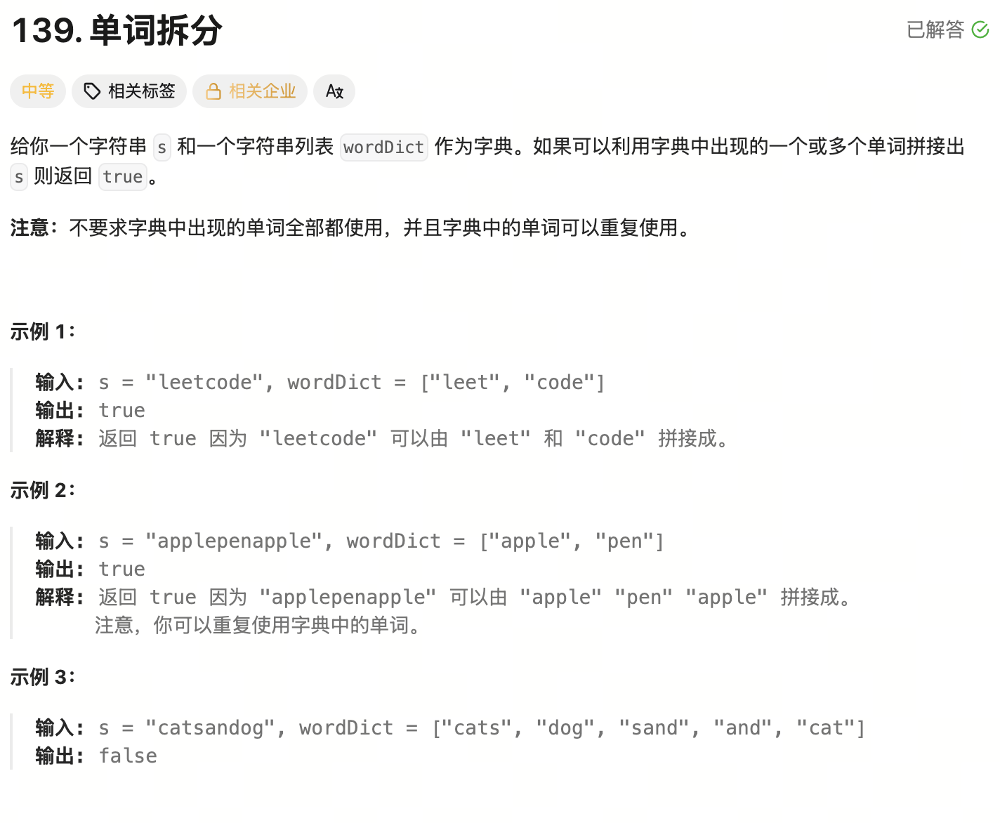
```
class Solution:
    def wordBreak(self, s: str, wordDict: List[str]) -> bool:
        """
        单词拆分
        核心思想：动态规划，dp[i] 表示 s 的前 i 个字符能否被成功拆分
        """
        # 将字典转换为集合，方便 O(1) 查找
        word_set = set(wordDict)
        n = len(s)
        
        # dp[i] 表示 s[0:i] 能否被拆分
        dp = [False] * (n + 1)
        dp[0] = True  # 空字符串可以被拆分
        
        # 遍历所有可能的结束位置 i
        for i in range(1, n + 1):
            # 枚举所有可能的分割点 j，检查 s[j:i] 是否在字典中
            for j in range(i):
                # 如果 dp[j] 为 True 且 s[j:i] 在字典中，则 dp[i] 为 True
                if dp[j] and s[j:i] in word_set:
                    dp[i] = True
                    break  # 找到一个分割点即可，无需继续
        
        return dp[n]
```

### 最长递增子序列
```
class Solution:
    def lengthOfLIS(self, nums: List[int]) -> int:
        """
        最长递增子序列
        核心思想：动态规划，dp[i] 表示以 nums[i] 结尾的最长递增子序列的长度
        """
        n = len(nums)
        if n == 0:
            return 0
        
        # dp[i] 表示以 nums[i] 结尾的最长递增子序列的长度
        dp = [1] * n  # 每个元素本身就是一个长度为1的递增子序列
        max_len = 1   # 记录全局最大值
        
        # 遍历每个位置 i
        for i in range(1, n):
            # 遍历 i 之前的所有位置 j
            for j in range(i):
                # 如果 nums[j] < nums[i]，可以接在后面形成更长的递增子序列
                if nums[j] < nums[i]:
                    dp[i] = max(dp[i], dp[j] + 1)
            # 更新全局最大值
            max_len = max(max_len, dp[i])
        
        return max_len
```

### 乘积最大子数组
```
class Solution:
    def maxProduct(self, nums: List[int]) -> int:
        """
        乘积最大子数组
        核心思想：动态规划，由于负数相乘可能使最大值变最小值、最小值变最大值，
                因此需要同时维护以当前位置结尾的最大乘积和最小乘积
        """
        n = len(nums)
        if n == 0:
            return 0
        
        # dp_max[i] 表示以 nums[i] 结尾的子数组的最大乘积
        # dp_min[i] 表示以 nums[i] 结尾的子数组的最小乘积
        dp_max = [0] * n
        dp_min = [0] * n
        
        # 初始化第一个元素
        dp_max[0] = nums[0]
        dp_min[0] = nums[0]
        max_product = nums[0]
        
        # 遍历每个位置
        for i in range(1, n):
            # 当前元素单独作为一个子数组，或者与前面的子数组合并
            # 由于可能负数相乘，最大值可能来自：
            # 1. 当前元素本身
            # 2. 前一个最大值 × 当前元素
            # 3. 前一个最小值 × 当前元素（当当前元素为负数时）
            dp_max[i] = max(nums[i], dp_max[i-1] * nums[i], dp_min[i-1] * nums[i])
            # 最小值类似，取三者中的最小值
            dp_min[i] = min(nums[i], dp_max[i-1] * nums[i], dp_min[i-1] * nums[i])
            
            # 更新全局最大值
            max_product = max(max_product, dp_max[i])
        
        return max_product
```
### 分割等和子集
```
class Solution:
    def canPartition(self, nums: List[int]) -> bool:
        total = sum(nums)
        if total % 2 != 0:
            return False
        
        target = total // 2
        
        # dp[j] 表示容量为 j 的背包能装下的最大和
        dp = [0] * (target + 1)
        
        # 0-1背包：外层物品，内层倒序 价值与重量一样
        for num in nums:
            for j in range(target, num - 1, -1):
                dp[j] = max(dp[j], dp[j - num] + num)
        
        # 如果背包能恰好装满，则 dp[target] == target
        return dp[target] == target
```
 ### 最长有效括号
 ```
 class Solution:
    def longestValidParentheses(self, s: str) -> int:
        """
        最长有效括号
        核心思想：动态规划，dp[i] 表示以 s[i] 结尾的最长有效括号子串的长度
        """
        n = len(s)
        if n <= 1:
            return 0
        
        # dp[i] 表示以 i 结尾的最长有效括号长度
        dp = [0] * n
        max_len = 0
        
        # 从 i=1 开始遍历，因为有效括号至少需要两个字符
        for i in range(1, n):
            if s[i] == ')':
                if s[i-1] == '(':
                    # 情况1：形如 "...()"，直接匹配
                    # dp[i] = dp[i-2] + 2
                    dp[i] = (dp[i-2] if i >= 2 else 0) + 2
                
                elif i - dp[i-1] > 0 and s[i - dp[i-1] - 1] == '(':
                    # 情况2：形如 "...((...))"，中间是有效括号，且前面有一个 '(' 与之匹配
                    # dp[i] = dp[i-1] + 2 + dp[i - dp[i-1] - 2]（如果存在的话）
                    dp[i] = dp[i-1] + 2
                    if i - dp[i-1] >= 2:
                        dp[i] += dp[i - dp[i-1] - 2]
                
                # 更新最大值
                max_len = max(max_len, dp[i])
        
        return max_len
```

### 不同路径
```
class Solution:
    def uniquePaths(self, m: int, n: int) -> int:
        """
        不同路径
        核心思想：动态规划，dp[i][j] 表示到达 (i,j) 的路径数
                只能向右或向下移动
        """
        # 创建 dp 数组，大小为 (m+1) x (n+1)，多出一行一列方便处理边界
        # 注意：原代码从1开始索引，这里保持一致
        dp = [[0] * (n + 1) for _ in range(m + 1)]
        
        # 起点位置 (1,1) 的路径数为1
        dp[1][1] = 1
        
        # 遍历每个格子
        for i in range(1, m + 1):
            for j in range(1, n + 1):
                # 跳过起点
                if i == 1 and j == 1:
                    continue
                # 到达 (i,j) 的路径数 = 从左边来的 + 从上边来的
                dp[i][j] = dp[i][j-1] + dp[i-1][j]
        
        return dp[m][n]
```
### 最小路径和
```
class Solution:
    def minPathSum(self, grid: List[List[int]]) -> int:
        """
        最小路径和
        核心思想：动态规划，dp[i][j] 表示到达 (i,j) 的最小路径和
                只能向右或向下移动
        """
        m, n = len(grid), len(grid[0])
        
        # 创建 dp 数组，与原网格大小相同
        dp = [[0] * n for _ in range(m)]
        
        # 遍历每个格子
        for i in range(m):
            for j in range(n):
                if i == 0 and j == 0:
                    # 起点：就是它本身
                    dp[i][j] = grid[i][j]
                elif i == 0:
                    # 第一行：只能从左边过来
                    dp[i][j] = dp[i][j-1] + grid[i][j]
                elif j == 0:
                    # 第一列：只能从上面过来
                    dp[i][j] = dp[i-1][j] + grid[i][j]
                else:
                    # 其他位置：取左边和上边的较小值，加上当前格子
                    dp[i][j] = min(dp[i][j-1], dp[i-1][j]) + grid[i][j]
        
        return dp[m-1][n-1]
```

### 最长回文子串
```
class Solution:
    def longestPalindrome(self, s: str) -> str:
        """
        最长回文子串
        核心思想：动态规划，dp[i][j] 表示子串 s[i:j+1] 是否是回文串
        """
        n = len(s)
        if n < 2:
            return s
        
        # 创建 dp 表，dp[i][j] 表示 s[i..j] 是否是回文串
        dp = [[False] * n for _ in range(n)]
        
        # 初始化：所有长度为1的子串都是回文
        for i in range(n):
            dp[i][i] = True
        
        max_len = 1
        start = 0
        
        # 遍历所有可能的子串长度
        # 注意：这里按列遍历，保证计算 dp[i][j] 时 dp[i+1][j-1] 已知
        for j in range(1, n):  # 右边界
            for i in range(j):  # 左边界
                if s[i] == s[j]:
                    # 如果子串长度 <= 2（即 j-i <= 2），直接为回文
                    if j - i <= 2:
                        dp[i][j] = True
                    else:
                        # 否则，取决于中间的子串是否是回文
                        dp[i][j] = dp[i+1][j-1]
                
                # 如果当前子串是回文，更新最长记录
                if dp[i][j] and j - i + 1 > max_len:
                    max_len = j - i + 1
                    start = i
        
        return s[start:start + max_len]
```
### 最长公共子序列
```
class Solution:
    def longestCommonSubsequence(self, text1: str, text2: str) -> int:
        """
        最长公共子序列
        核心思想：动态规划，dp[i][j] 表示 text1 的前 i 个字符和 text2 的前 j 个字符的 LCS 长度
        """
        m, n = len(text1), len(text2)
        
        # 创建 dp 表，大小为 (m+1) x (n+1)，多出一行一列方便处理边界
        dp = [[0] * (n + 1) for _ in range(m + 1)]
        
        # 遍历所有位置
        for i in range(1, m + 1):
            for j in range(1, n + 1):
                if text1[i-1] == text2[j-1]:
                    # 当前字符相等，可以加入公共子序列
                    dp[i][j] = dp[i-1][j-1] + 1
                else:
                    # 当前字符不等，取左边或上边的较大值
                    dp[i][j] = max(dp[i-1][j], dp[i][j-1])
        
        return dp[m][n]
```


### 编辑距离
```
class Solution:
    def minDistance(self, word1: str, word2: str) -> int:
        """
        编辑距离
        核心思想：动态规划，dp[i][j] 表示 word1 的前 i 个字符转换为 word2 的前 j 个字符所需的最少操作数
        操作：插入、删除、替换，每种操作代价为1
        """
        m, n = len(word1), len(word2)
        
        # 创建 dp 表，大小为 (m+1) x (n+1)，多出一行一列处理空字符串
        dp = [[0] * (n + 1) for _ in range(m + 1)]
        
        # 初始化边界：将一个字符串转换为空串
        for i in range(1, m + 1):
            dp[i][0] = i  # 删除 i 个字符
        for j in range(1, n + 1):
            dp[0][j] = j  # 插入 j 个字符
        
        # 填充 dp 表
        for i in range(1, m + 1):
            for j in range(1, n + 1):
                if word1[i-1] == word2[j-1]:
                    # 当前字符相等，不需要额外操作
                    dp[i][j] = dp[i-1][j-1]
                else:
                    # 当前字符不等，取三种操作的最小值 + 1
                    dp[i][j] = min(
                        dp[i-1][j],      # 删除 word1[i-1]
                        dp[i][j-1],      # 插入 word2[j-1] 到 word1
                        dp[i-1][j-1]     # 替换 word1[i-1] 为 word2[j-1]
                    ) + 1
        
        return dp[m][n]
```

## 技巧
###  只出现一次的数字
```
def singleNumber(self, nums: List[int]) -> int:
    """异或运算：相同数字异或为0，0异或任何数等于任何数"""
    result = 0
    for num in nums:
        result ^= num
    return result
```


### 
```
class Solution:
    def majorityElement(self, nums: List[int]) -> int:
        """
        多数元素
        核心思想：使用哈希表统计每个元素出现的次数，当某个元素出现次数 > n/2 时返回
        """
        n = len(nums)
        count_map = {}
        
        for num in nums:
            # 统计当前数字的出现次数
            count_map[num] = count_map.get(num, 0) + 1
            
            # 如果当前数字的出现次数超过半数，直接返回
            if count_map[num] > n // 2:
                return num
        
        return -1  # 题目保证有解，不会执行到这里
```

### 颜色分类
```
class Solution:
    def sortColors(self, nums: List[int]) -> None:
        """
        颜色分类（荷兰国旗问题）
        核心思想：两次遍历，第一次把所有的0放到前面，第二次把所有的1放到0后面
        """
        n = len(nums)
        ptr = 0  # ptr 指向当前已排好位置的下一个位置
        
        # 第一次遍历：将所有 0 移动到数组前面
        for i in range(n):
            if nums[i] == 0:
                nums[i], nums[ptr] = nums[ptr], nums[i]
                ptr += 1
        
        # 第二次遍历：将所有 1 移动到 0 的后面
        for i in range(ptr, n):
            if nums[i] == 1:
                nums[i], nums[ptr] = nums[ptr], nums[i]
                ptr += 1
```

### 下一个排列
```
class Solution:
    def nextPermutation(self, nums: List[int]) -> None:
        """
        下一个排列
        核心思想：1. 从后向前找到第一个升序对 (nums[i-1] < nums[i])
                2. 在 i 到末尾找到第一个大于 nums[i-1] 的数并交换
                3. 将 i 到末尾反转（使其变为升序，即最小排列）
        """
        n = len(nums)
        if n <= 1:
            return
        
        # 1. 从后向前找到第一个升序对 (nums[i-1] < nums[i])
        i = n - 1
        while i > 0 and nums[i-1] >= nums[i]:
            i -= 1
        
        # 如果找到了升序对
        if i > 0:  # i-1 就是需要交换的位置
            # 2. 从后向前找到第一个大于 nums[i-1] 的数
            j = n - 1
            while nums[j] <= nums[i-1]:
                j -= 1
            # 交换
            nums[i-1], nums[j] = nums[j], nums[i-1]
        
        # 3. 反转 i 到末尾的部分（使其变为升序）
        # 如果 i == 0，说明整个数组是降序，反转整个数组
        left, right = i, n - 1
        while left < right:
            nums[left], nums[right] = nums[right], nums[left]
            left += 1
            right -= 1
```

### 寻找重复数
```
class Solution:
    def findDuplicate(self, nums: List[int]) -> int:
        """
        寻找重复数
        核心思想：将数组视为链表，nums[i] 作为 next 指针的索引
                利用快慢指针找到环的入口，即为重复的数
        """
        # 初始化快慢指针
        slow = nums[0]
        fast = nums[nums[0]]
        
        # 第一阶段：快慢指针在环中相遇
        while slow != fast:
            slow = nums[slow]
            fast = nums[nums[fast]]
        
        # 第二阶段：将慢指针重置到起点，然后快慢指针以相同速度移动
        # 相遇点即为环的入口（重复的数）
        slow = 0
        while slow != fast:
            slow = nums[slow]
            fast = nums[fast]
        
        return slow
```